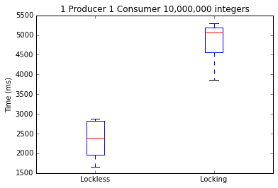
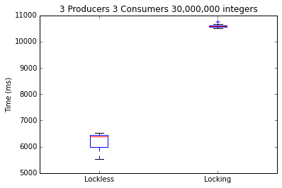

                Lockless Queue vs locking queue.
                

    import numpy as np
    import matplotlib.pyplot as plt
    import os

    os.listdir('.')
    x = np.genfromtxt("ten_million-two_threads.csv", delimiter=",", skip_header=1)

    fig = plt.figure()
    
    ax = fig.add_subplot(111)
    
    ax.boxplot([x[:,0],x[:,1]], labels=["Lockless", "Locking"])
    ax.set_title("1 Producer 1 Consumer 10,000,000 integers")
    ax.set_ylabel("Time (ms)")
    plt.show()

    os.listdir('.')
    x = np.genfromtxt("ten_million-four_threads.csv", delimiter=",", skip_header=1)

    fig = plt.figure()
    
    ax = fig.add_subplot(111)
    
    ax.boxplot([x[:,0],x[:,1]], labels=["Lockless", "Locking"])
    ax.set_title("2 Producers 2 Consumers 20,000,000 integers")
    ax.set_ylabel("Time (ms)")
    plt.show()

    os.listdir('.')
    x = np.genfromtxt("ten_million-four_threads.csv", delimiter=",", skip_header=1)

    fig = plt.figure()
    
    ax = fig.add_subplot(111)
    
    ax.boxplot([x[:,0],x[:,1]], labels=["Lockless", "Locking"])
    ax.set_title("3 Producers 3 Consumers 30,000,000 integers")
    ax.set_ylabel("Time (ms)")
    plt.show()

